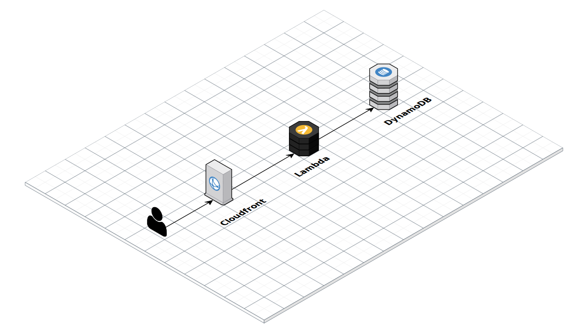

# Kurzen - URL Shortener Engine

## What it is?

A URL shortener engine made with Typescript and CDK, and it is ready to be deployed on AWS.

## What it isn't?

A full fledge URL shortener service, nor it tries to be.

## What it does?

* Retrieves a URL stored on DynamoDB based on a slug passed through the URL path.
* Redirects the client to the URL from the DynamoDB document.
* Caches the redirect response in CloudFront.

## Infrastructure
* [Lambda](https://aws.amazon.com/lambda) for computing
* [DynamoDB](https://aws.amazon.com/lambda) as storage
* [CloudFront](https://aws.amazon.com/lambda) for caching

